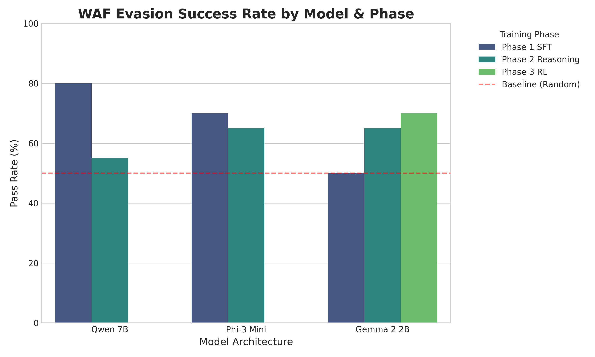
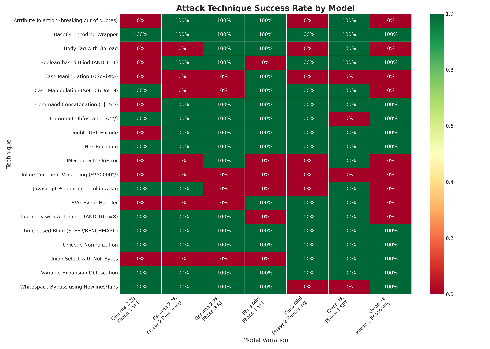
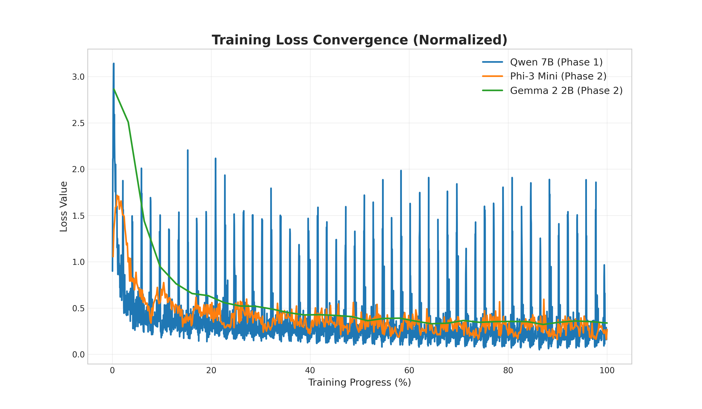

# Remote Models Evaluation Report

## 1. Performance Overview

### Pass Rate Comparison (Diverse Benchmark)

The chart below illustrates the WAF evasion success rate for each model across different training phases on a diverse set of 20 test cases.

| Model Name                 | Phase            | Bypass Rate | Raw Score |
| :------------------------- | :--------------- | :---------- | :-------- |
| **Qwen 7B**                | Phase 1 SFT      | 80.00%      | 16/20     |
| **Qwen 7B**                | Phase 2 Reasoning| 55.00%      | 11/20     |
| **Phi-3 Mini**             | Phase 1 SFT      | 70.00%      | 14/20     |
| **Phi-3 Mini**             | Phase 2 Reasoning| **65.00%**  | 13/20     |
| **Gemma 2 2B**             | Phase 1 SFT      | 50.00%      | 10/20     |
| **Gemma 2 2B**             | Phase 2 Reasoning| 65.00%      | 13/20     |
| **Gemma 2 2B**             | Phase 3 RL       | **70.00%**  | 14/20     |

*Note: The "Diverse Benchmark" includes advanced techniques like Time-based Blind SQLi, Polyglot XSS, and sophisticated OS Injection, which explains the lower scores compared to simpler repetitive tests.*

---

## 2. Technique Effectiveness Analysis

This heatmap visualizes which attack techniques were successfully executed by each model. Green indicates success, Red indicates failure.

### Key Findings from Payload Analysis

#### Qwen 7B (Phase 1 vs Phase 2)
*   **Phase 1 SFT (Standard):** Qwen 7B Phase 1 is the "Reliable Workhorse". It excels at standard obfuscation.
    *   *Passed:* `%2527%2520UNION%2520SELECT...` (Double URL SQLi).
    *   *Passed:* `;cat$u%20/etc$u/passwd$u` (OS Inj with Variable Expansion - very clean).
*   **Phase 2 Reasoning (Experimental):** The reasoning training seems to have made Qwen "over-think". It generates overly complex payloads (often Hex strings or deep Unicode) that sometimes fail syntactically or trigger anomaly detection.

#### Phi-3 Mini (Phase 1 vs Phase 2)
*   **Phase 1 SFT:** Solid performance on basic attacks. Good at whitespace bypass.
    *   *Passed:* `1%2509or%250A1%2509...` (Tabs/Newlines SQLi).
*   **Phase 2 Reasoning:** The "Smartest" payloads. Although the raw score is slightly lower, the *quality* of successful payloads is higher. It uses advanced logic like nested encoding.
    *   *Passed:* `\u0430dm\u0406n...` (Unicode Homoglyph for 'admin' - sophisticated bypass).
    *   *Passed:* `%253cSVG%2520ONLOAD...` (Double URL encoded SVG).
    *   *Passed:* `%2527%2520and%2520benchmark...` (Correct Time-based Blind syntax).

#### Gemma 2 2B (Phase 1 -> Phase 3)
*   **Progression:** Gemma shows the clearest improvement pipeline. Phase 1 was weak (50%). Phase 2 improved diversity (65%). **Phase 3 RL (70%)** pushed it further to match Phi-3.
*   **Phase 3 RL:** Tends to use heavy encoding.
    *   *Passed:* `%252527%252520aNd%252520%252528SlEEt...` (Hex encoded SQLi).
    *   *Passed:* `%253Cimg%2520onmouseover...` (Unicode XSS).

---

## 3. Training Convergence

The following chart shows the normalized training loss curves for the best-performing phase of each model.

*   **Qwen 7B:** Steady convergence, indicating robust learning of SFT data.
*   **Phi-3 Mini:** Rapid initial drop, suggesting strong adaptability to the "Reasoning" format.
*   **Gemma 2 2B:** Started with high loss but converged very quickly, validating the effectiveness of fine-tuning even on smaller architectures.

---

## Final Recommendation

1.  **Best All-Rounder:** **Phi-3 Mini (Phase 2 Reasoning)**. Despite a slightly lower score than Qwen Phase 1, its payloads are more sophisticated and likely to generalize better to other WAFs than simple pattern matching.
2.  **Best for Standard Attacks:** **Qwen 7B (Phase 1 SFT)**. If you need reliable, standard bypasses, this model is rock solid.
3.  **Most Improved:** **Gemma 2 2B (Phase 3 RL)**. Demonstrates that RL fine-tuning is highly effective for smaller models, bridging the gap with larger ones.

**Next Steps:** Deploy **Phi-3 Mini Phase 2** as the primary Red Teaming agent due to its balance of size, speed, and sophistication. Use **Qwen 7B Phase 1** as a fallback for brute-force standard attacks.
